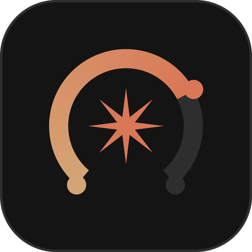
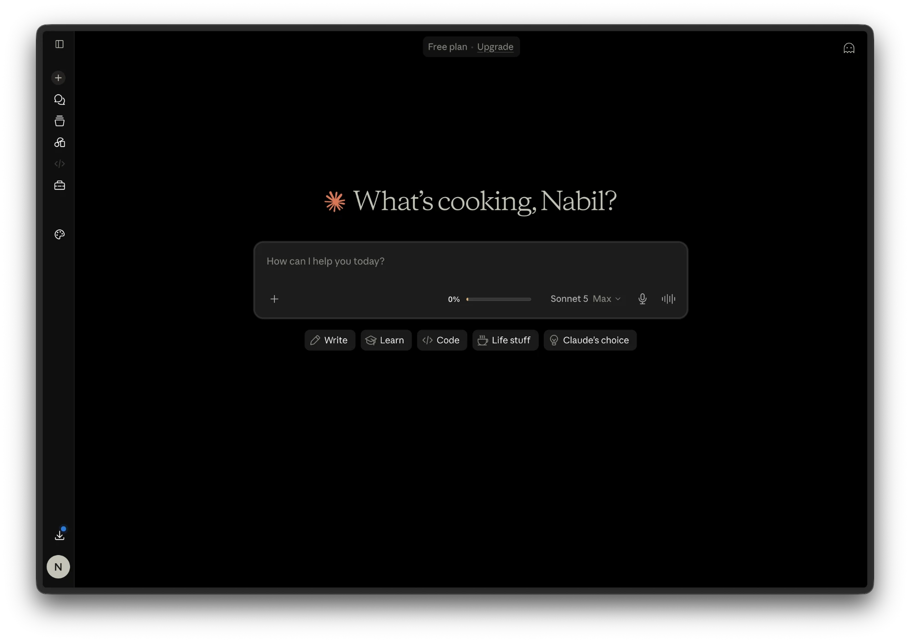
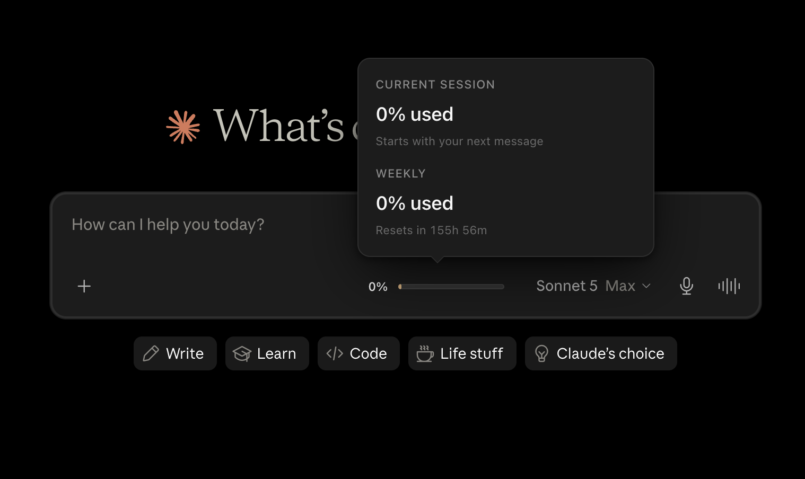
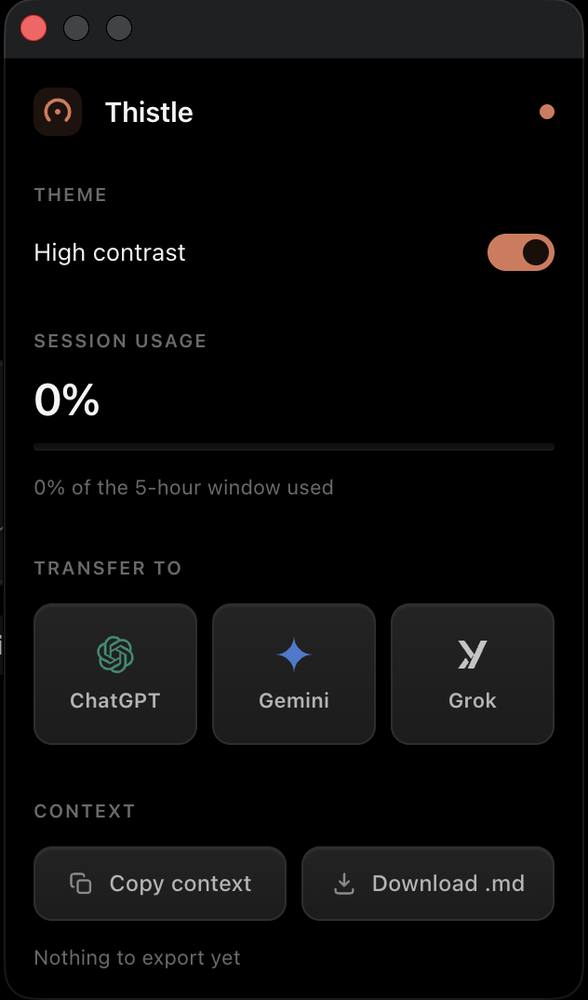

<div align="center">



# Thistle — Toolkit for Claude

**A high-contrast dark mode for claude.ai, an inline usage gauge, and one-click hand-off to other chatbots.**



</div>

---

Four additions to the Claude web app:

- **High-contrast dark mode.** Makes the Claude web interface true black. Coral stays as the one accent colour.
- **Inline usage gauge.** Your session limit, right in the composer between the `+` and the model picker — percentage, a progress bar, and a countdown to reset. Click it for weekly usage too.
- **Context transfer.** Send the current conversation to ChatGPT, Gemini, or Grok in one click, with the text already typed into their composer.
- **Markdown export.** Copy or download the open conversation.

Nothing leaves your browser. There is no account, no server, and no analytics — see [Privacy](#privacy).

---

## Install

There's no Chrome Web Store listing yet, so it installs as an unpacked extension. Takes about a minute.

### 1. Download it

Grab the latest `.zip` from the [Releases page](../../releases) and unzip it. Or, if you'd rather use git:

```bash
git clone https://github.com/leo-noble/Thistle.git
```

Whichever you pick, **remember where the folder is** — the browser needs it to stay put. If you move or delete it later, the extension stops working. Somewhere permanent like `Documents` beats `Downloads`.

The folder you want is the one with `manifest.json` sitting directly inside it.

### 2. Load it

**Chrome, Edge, Brave, Arc, Opera**

1. Open `chrome://extensions` (Edge: `edge://extensions`, Brave: `brave://extensions`).
2. Turn on **Developer mode** — top-right corner.
3. Click **Load unpacked**.
4. Select the folder containing `manifest.json`.

**Firefox**

Thistle is on addons.mozilla.org — no manual steps needed, just install and go:

[**Get Thistle for Firefox**](https://addons.mozilla.org/en-US/firefox/addon/thistle-toolkit-for-claude/)

### 3. Use it

Open [claude.ai](https://claude.ai) — or reload it if it was already open. The theme applies immediately and the usage gauge appears in the composer.

Pin the extension to your toolbar (puzzle-piece icon → pin) to reach the settings popup quickly.

---

## Usage gauge

The gauge sits in the composer toolbar, just right of the `+` button:

- **Percentage** — how much of the current 5-hour session window you've used.
- **Bar** — the same figure, at a glance. It turns coral past 90%.
- **Countdown** — time until the window resets.
- **Click it** — a panel opens with both the session and the weekly limit, each with its own reset time.



The numbers come from the same endpoint the Claude web app uses for its own limit warnings, so they match what Claude tells you. At 0% the session window hasn't opened yet and there's no reset time to show — it starts counting from your next message.

## Context transfer

Click the toolbar icon, then pick **ChatGPT**, **Gemini**, or **Grok**. The conversation is read out of the page, rendered as Markdown, and typed into the other site's composer in a new tab. It doesn't hit send — you get to look it over first.

Useful for second opinions, or for carrying on when you've hit a limit.

## Settings

The toolbar popup has:

| | |
|---|---|
| **High contrast** | Toggles the theme. Off restores claude.ai's own appearance without disabling the extension. |
| **Session usage** | The same figures as the inline gauge. |
| **Transfer to** | ChatGPT / Gemini / Grok. |
| **Export** | Copy or download the conversation as Markdown. |



---

## Privacy

The extension holds `storage`, `scripting`, and `activeTab`, and runs only on `claude.ai` plus the three chatbot sites it can transfer to.

- Usage figures are read from claude.ai's own API, in your browser, using your existing session. Nothing is sent anywhere else.
- Conversation text is only read when *you* click transfer or export. It goes to the site you picked, and nowhere else.
- No telemetry, no analytics, no remote code, no network requests to any server the extension controls — because there isn't one.

Settings live in `chrome.storage.local`, on your machine.

## Troubleshooting

**The theme didn't apply.** Reload the claude.ai tab — content scripts only attach to pages loaded after the extension.

**The gauge shows `—` and never fills.** It needs a moment for the first request to complete. If it stays empty, make sure you're signed in — the figures come from an authenticated endpoint.

**The gauge vanished after Claude updated.** Claude's class names are generated and change without warning. Open an issue with a screenshot; the composer detection is deliberately structural rather than class-based, but it isn't immune.

**Everything broke after I moved the folder.** Unpacked extensions are loaded by path. Re-run **Load unpacked** and point at the new location.

**Transfer typed nothing.** The receiving site changed its composer markup. Open an issue naming the site.

---

## Credits

The usage-reading approach — the page-context bridge, the SSE `message_limit`
observer, the `/usage` payload shape — is derived from **Claude Counter**
(v0.4.2), MIT licensed. See [THIRD_PARTY_NOTICES.md](THIRD_PARTY_NOTICES.md).

Not affiliated with, endorsed by, or connected to Anthropic. "Claude" is Anthropic's trademark.

## License

MIT — see [LICENSE](LICENSE).
